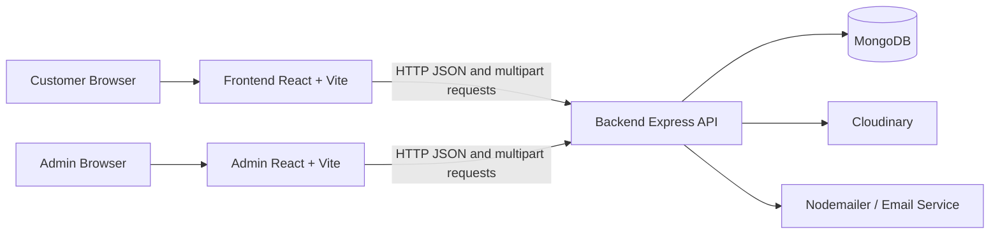

# E-Commerce Site System Architecture

## 1. System Overview

This repository contains three applications:



The applications are deployed and developed independently:

- `Frontend/` is the customer-facing storefront.
- `Admin/` is the administration dashboard.
- `Backend/` provides authentication, catalog, cart, wishlist, address, and product specification APIs.

## 2. Repository Layout

```text
E-Commerce_site/
|-- Frontend/                 Customer storefront
|   |-- src/App.tsx           Application shell and customer routes
|   |-- src/pages/            Full page views
|   |-- src/components/       Reusable storefront components
|   |-- src/context/          Shared customer state and notifications
|   |-- src/utils/api.ts      Axios API helpers
|   |-- src/assets/           Product, banner, and blog assets
|   `-- package.json
|
|-- Admin/                    Admin dashboard
|   |-- src/App.tsx           Admin context and router provider
|   |-- src/Pages/            Dashboard, products, orders, users, and auth pages
|   |-- src/Components/       Sidebar, header, charts, forms, and shared UI
|   |-- src/routes/            Admin route configuration
|   |-- src/utils/api.ts      Admin API helpers
|   `-- package.json
|
|-- Backend/                  Express API service
|   |-- index.js              Express application entry point
|   |-- Config/               MongoDB and email configuration
|   |-- controllers/          Request handlers and business operations
|   |-- middleware/            Authentication and upload middleware
|   |-- models/               Mongoose schemas
|   |-- route/                Express route modules
|   |-- uploads/              Local uploaded files
|   `-- package.json
|
`-- SYSTEM_ARCHITECTURE.md    This document
```

## 3. Frontend Architecture

### Customer storefront

`Frontend/src/App.tsx` is the customer application shell. It provides:

- Global `MyContext` state.
- Header, footer, and cart drawer around all pages.
- Product details dialog state.
- Authentication state loaded from the browser token.
- Toast notifications through `react-hot-toast`.
- Customer routes for home, products, authentication, cart, checkout, account, wishlist, and orders.

The customer request flow is:

```text
Page or component
    -> Frontend/src/utils/api.ts
    -> Axios with VITE_API_URL and bearer token
    -> Backend /api/* route
    -> Controller
    -> Mongoose model or external service
```

Customer route map:

| Route                 | Responsibility                                       |
| --------------------- | ---------------------------------------------------- |
| `/`                   | Home page, banners, categories, and product sections |
| `/productDetails`     | Product listing                                      |
| `/productDetails/:id` | Product details                                      |
| `/login`              | User login                                           |
| `/sign-in`            | User registration                                    |
| `/verify`             | Email or OTP verification                            |
| `/forgot-password`    | Start password recovery                              |
| `/reset-password`     | Complete password recovery                           |
| `/cart`               | Cart page                                            |
| `/checkout`           | Checkout flow                                        |
| `/my-account`         | User account and addresses                           |
| `/my-list`            | Wishlist                                             |
| `/my-orders`          | Orders                                               |

### Admin dashboard

`Admin/src/App.tsx` supplies admin-wide UI state and uses `RouterProvider` with the route configuration in `Admin/src/routes/`. The dashboard is organized around:

- Dashboard summary boxes and sales visualization.
- Product, category, and subcategory management.
- Orders and users.
- Admin authentication.
- Profile and avatar management.

## 4. Backend Architecture

`Backend/index.js` creates the Express app and registers middleware in this order:

1. Environment loading with `dotenv`.
2. CORS with credentials for local frontend ports.
3. JSON body parsing.
4. Cookie parsing.
5. HTTP request logging with `morgan`.
6. Security headers with `helmet`.
7. API route registration.
8. MongoDB connection, then HTTP server startup.

Backend route map:

| Prefix              | Responsibility                                           |
| ------------------- | -------------------------------------------------------- |
| `/api/user`         | Registration, login, profile, password, and user details |
| `/api/category`     | Category management                                      |
| `/api/product`      | Product management and product queries                   |
| `/api/cart`         | Add, read, update, and remove cart items                 |
| `/api/mylist`       | Wishlist operations                                      |
| `/api/address`      | User address CRUD and default address selection          |
| `/api/productSpecs` | RAM, size, and weight specification management           |

Controller and model responsibilities:

```text
HTTP request
    -> route/*.route.js
    -> middleware/auth.js when authentication is required
    -> controllers/*.controller.js
    -> models/*.js
    -> MongoDB
```

External integrations:

- `Config/connectDb.js` connects Mongoose to `MONGODB_URI`.
- `Config/emailService.js` and `Config/sendEmail.js` send verification and recovery emails.
- `cloudinary` handles remote media storage where configured.
- `middleware/multer.js` handles multipart upload parsing.

## 5. Authentication and Authorization

1. A user submits login or registration data from the storefront.
2. The backend validates credentials and returns an access token and refresh token.
3. The frontend stores the access token in `localStorage` under `token`.
4. `Frontend/src/utils/api.ts` sends the token as a bearer authorization header.
5. Protected backend routes use `middleware/auth.js` to validate the token and attach the user identity to the request.
6. User-specific data is queried using that authenticated identity.

The admin frontend uses its own token storage and API helper conventions. Admin access should be enforced by backend authorization middleware before exposing administrative mutations.

## 6. Core Data Domains

- Users: identity, login credentials, verification, profile information.
- Categories: product grouping and navigation.
- Products: catalog details, pricing, images, and inventory-facing attributes.
- Product specifications: RAM, size, and weight options.
- Cart: user-owned product selections and quantities.
- Wishlist: user-owned saved products.
- Addresses: user-owned delivery addresses and default address state.
- Orders: checkout and order-history data used by the storefront and admin dashboard.

## 7. Local Development

Install dependencies in each application separately:

```powershell
Set-Location Backend
npm install

Set-Location ..\Frontend
npm install

Set-Location ..\Admin
npm install
```

Run the services in separate terminals:

```powershell
# API service
Set-Location Backend
node index.js

# Customer storefront
Set-Location ..\Frontend
npm run dev

# Admin dashboard
Set-Location ..\Admin
npm run dev
```

Required environment configuration should be stored in local `.env` files and never committed:

- Backend: `MONGODB_URI`, `PORT`, JWT secrets, email settings, and media settings.
- Frontend: `VITE_API_URL`.
- Admin: its API base URL and admin-specific settings.

The current backend package scripts reference `server.js`, but the checked-in backend entry point is `index.js`. Use `node index.js` until the script is corrected.

## 8. Build and Validation

```powershell
# Frontend
Set-Location Frontend
npm run lint
npm run build

# Admin
Set-Location ..\Admin
npm run lint
npm run build
```

The backend currently has no test script. API behavior should be checked with authenticated and unauthenticated requests against each route group.

## 9. Extension Guidelines

When adding a feature:

1. Add or update a Mongoose model only for new persisted data.
2. Add the controller operation and keep database logic out of route files.
3. Register the route under the appropriate `/api/*` prefix.
4. Protect user-owned or admin-only operations with authentication middleware.
5. Add the matching frontend API call in the relevant `utils/api.ts` helper.
6. Keep shared UI state in the existing context only when multiple pages need it.
7. Add a page or component route in the owning application.
8. Validate both loading and API-failure states in the UI.
